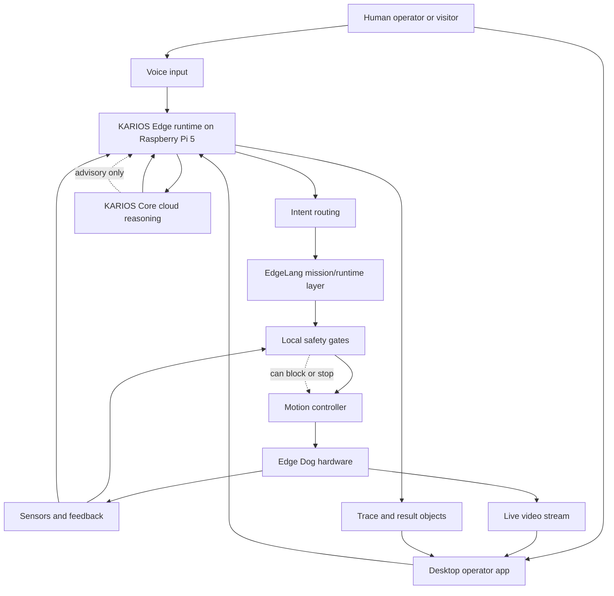

# System Architecture

Edge Dog uses an edge-first architecture. The robot owns real-time safety, motion, sensor checks, and local task execution. Higher-level reasoning can be assisted by KARIOS Core in the cloud, but cloud responses do not directly drive motors.

## High-Level Diagram

## Edge Responsibilities

KARIOS Edge runs on the robot and owns:

- wake and command handling
- local intent routing
- mission execution
- EdgeLang runtime execution
- sensor checks
- motion safety gates
- stop and emergency-stop priority
- telemetry and trace output
- local operator app communication

## Cloud Responsibilities

KARIOS Core is used for higher-level reasoning:

- richer conversation
- broad factual explanation
- planning support
- clarification support
- contextual reasoning

KARIOS Core is not a direct motor controller. It can advise the edge runtime, but the robot decides whether an action is safe to execute.

## Desktop Operator App

The desktop app provides technician visibility:

- live video stream
- sensor and runtime state
- motion status
- remote command input
- audio interaction support
- recording capability
- operator supervision during demos

## Why This Split Matters

Robots operate in the physical world. If network latency, cloud availability, or conversational uncertainty affects safety, the architecture is wrong.

Edge Dog separates these concerns:

- The edge handles timing-sensitive safety.
- The cloud handles deeper reasoning.
- EdgeLang provides deterministic behavior structure.
- The operator app provides visibility and control.
